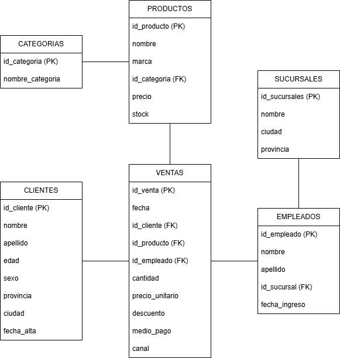

# Modelo Entidad-Relación

## Descripción

La base de datos de NovaTech Solutions fue diseñada siguiendo un modelo relacional normalizado para gestionar información comercial.

El objetivo es almacenar clientes, productos, empleados y ventas evitando redundancia de datos y manteniendo la integridad referencial.

---

## Entidades

- Clientes
- Productos
- Categorías
- Empleados
- Sucursales
- Ventas
- Usuarios
- Auditoría

---

## Relaciones principales

- Un cliente puede realizar muchas ventas.
- Un producto pertenece a una categoría.
- Una categoría contiene muchos productos.
- Un empleado trabaja en una sucursal.
- Una sucursal posee muchos empleados.
- Una venta pertenece a un cliente.
- Una venta es registrada por un empleado.
- Una venta contiene uno o varios productos.

---

## Diagrama

---

## Integridad referencial

La base de datos utiliza claves foráneas para garantizar la consistencia entre tablas.

Ejemplos:

- ventas.id_cliente → clientes.id_cliente
- ventas.id_producto → productos.id_producto
- empleados.id_sucursal → sucursales.id_sucursal
