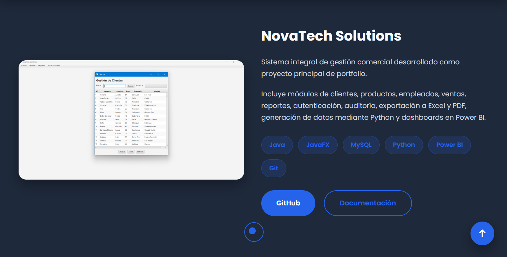
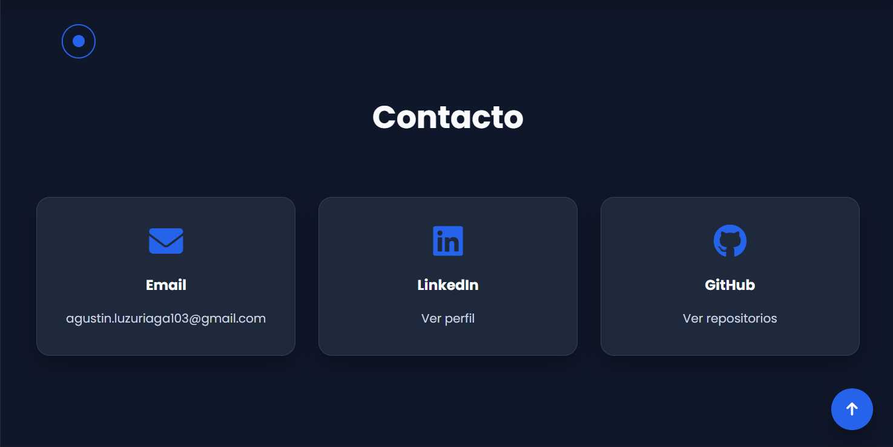

# 🌐 Portfolio Personal - Agustín Luzuriaga

Portfolio web desarrollado para presentar mi perfil profesional, proyectos y habilidades como Técnico Universitario en Programación.

## 📌 Descripción

Este sitio reúne mi información profesional, tecnologías, proyectos y formas de contacto en un único lugar.

El objetivo es ofrecer una presentación clara y moderna para reclutadores y empresas.

## 🚀 Características

- Diseño moderno y responsive
- Modo oscuro
- Navegación de una sola página (Single Page)
- Animaciones suaves
- Descarga del CV
- Enlaces a GitHub y LinkedIn
- Proyecto principal destacado
- Compatible con dispositivos móviles

## 🛠 Tecnologías

- HTML5
- CSS3 (custom, sin frameworks)
- JavaScript (vanilla)
- Font Awesome (íconos)
- Git
- GitHub Pages

## 📁 Estructura del proyecto

```text
portfolio/
│
├── index.html
├── css/
│   ├── styles.css
│   └── responsive.css
│
├── js/
│   └── main.js
│
├── assets/
│   ├── img/
│   ├── icons/
│   ├── screenshots/
│   └── cv/
│
└── README.md
```

## 📂 Secciones

- Inicio
- Sobre mí
- Tecnologías
- Proyecto destacado
- Otros proyectos
- Contacto

## 📸 Capturas

### Página principal


### Sección de proyectos



### Contacto



## 📄 Proyecto destacado

Actualmente el proyecto principal mostrado en el portfolio es:

### NovaTech Solutions

Sistema de gestión comercial desarrollado como proyecto de portfolio.

Tecnologías utilizadas:

- Java
- JavaFX
- MySQL
- JDBC
- Python
- Power BI
- Maven
- Git

Repositorio:
<https://github.com/AgusLuzu2004/Portfolio-Novatech-Solutions.git>

## 💻 Instalación

Este sitio vive dentro del repo de NovaTech Solutions, en la carpeta `portfolio/` (no es un repositorio aparte).

Clonar el repositorio principal:

```bash
git clone https://github.com/AgusLuzu2004/Portfolio-Novatech-Solutions.git
```

Abrir el archivo:

```text
portfolio/index.html
```

## 🌐 Publicarlo con GitHub Pages

GitHub Pages, en su configuración simple, solo sirve desde la raíz del repo o desde `/docs` — y `/docs` ya se usa acá para la documentación técnica del proyecto. Para publicar este sitio hay dos opciones:

1. Crear un repositorio aparte (por ejemplo `AgusLuzu2004.github.io`) y subir ahí el contenido de `portfolio/`.
2. Agregar un workflow de GitHub Actions que copie `portfolio/` a una rama `gh-pages`.

## 🌐 Demo

<https://AgusLuzu2004.github.io/> (una vez publicado con alguna de las opciones de arriba)

## 📬 Contacto

GitHub:

<https://github.com/AgusLuzu2004>

LinkedIn:

<https://linkedin.com/in/agustín-luzuriaga-ba464a197/>

Email:

<agustin.luzuriaga103@gmail.com>

## 📄 Licencia

Este proyecto está distribuido bajo la licencia MIT.
